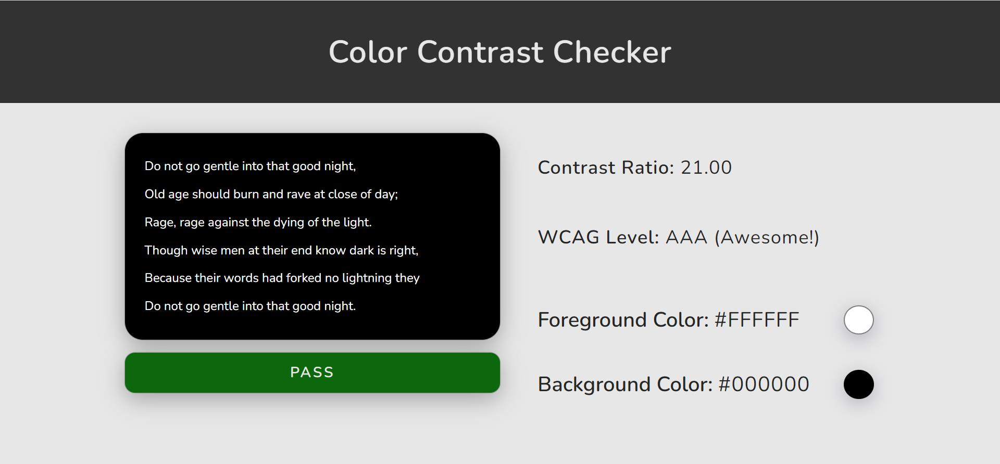

# Color Contrast Checker

This is a Web App that helps users check the color contrast ratio, WCAG level, and whether the accessbility of their choices of color passes the test or not. Users can input a background color and a foreground color. They can preview the effect and view the feedback.

## Devices

This App is designed for desktop devices.
